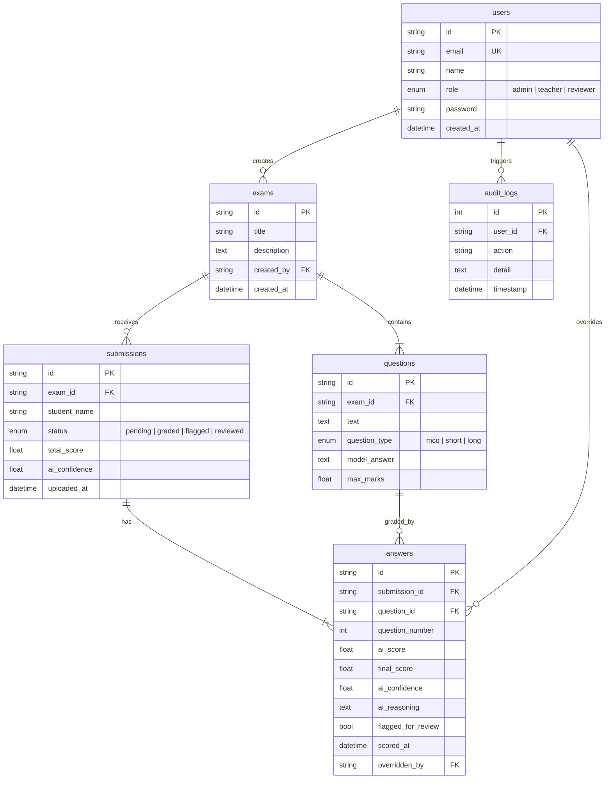

<div align="center">


# 🎯 ScorePilot AI

### The Future Operating System for AI-Powered Academic Evaluation

[](https://nextjs.org/)
[](https://fastapi.tiangolo.com/)
[](https://www.postgresql.org/)
[](https://tailwindcss.com/)
[](https://www.typescriptlang.org/)
[](https://python.org/)
[](https://docker.com/)
[](https://github.com/xenon-creator/ScorePilot-AI/actions)

<br />

**ScorePilot AI** transforms how academic institutions grade exams — combining intelligent OCR extraction, semantic AI scoring, and human-in-the-loop review into one cinematic, enterprise-grade platform.

<br />

[🚀 Getting Started](#-getting-started) · [✨ Features](#-features) · [🏗️ Architecture](#️-architecture) · [📖 API Reference](#-api-reference) · [🎨 Design System](#-design-system)

<br />

---

</div>

## ✨ Features

### 🤖 AI-Powered Scoring Engine
- **Semantic Analysis** — Goes beyond keyword matching using transformer-based models that understand meaning, context, and reasoning quality
- **Multi-Question Support** — Handles MCQ (exact match), Short Answer (keyword + semantic similarity), and Long Answer (rubric-based weighted evaluation)
- **Confidence Scoring** — Every AI grade includes a confidence percentage; low-confidence submissions are automatically flagged for human review
- **Explainable AI** — Full reasoning traces for every score, including matched criteria, coverage percentages, and missing points

### 📄 Intelligent OCR Pipeline
- **Handwriting Recognition** — AI-powered extraction from scanned answer sheets, PDFs, and images
- **Multi-Format Support** — Upload scanned papers in JPG, PNG, PDF, or TIFF
- **Auto-Orientation Correction** — Handles rotated or skewed scans
- **Field-Level Confidence** — Per-question extraction reliability scores

### 👨‍🏫 Human-in-the-Loop Review
- **Review Queue** — Prioritized queue of flagged submissions requiring human attention
- **Side-by-Side View** — Student response alongside AI assessment with confidence indicators
- **Score Override** — Teachers can approve, adjust, or override any AI-generated score with audit trail
- **Batch Processing** — Efficiently review multiple papers in sequence

### 📊 Real-Time Analytics Dashboard
- **Score Distributions** — Visual breakdown across cohorts and assessments
- **Question Difficulty Index** — Identify which questions students struggle with most
- **Pass/Fail Analytics** — Real-time pass rates with historical comparison
- **AI Accuracy Metrics** — Track how AI scoring improves over time

### 🔐 Enterprise Security
- **JWT Authentication** — Secure token-based auth with role-based access control
- **Role System** — Admin, Teacher, and Reviewer roles with granular permissions
- **Audit Trail** — Complete log of every action: logins, uploads, score changes, overrides
- **CORS Protection** — Configurable cross-origin policies

---

## 🏗️ Architecture

```
ScorePilot-AI/
├── backend/                    # FastAPI Python Backend
│   ├── alembic/                # Database migration system
│   │   ├── versions/           # Auto-generated migration scripts
│   │   ├── env.py              # Alembic config (imports from app)
│   │   └── script.py.mako      # Migration template
│   ├── alembic.ini             # Alembic settings
│   ├── app/
│   │   ├── core/
│   │   │   ├── config.py       # Environment & app settings
│   │   │   └── security.py     # JWT, password hashing, RBAC
│   │   ├── models/
│   │   │   └── database.py     # SQLAlchemy 2.0 models & get_db()
│   │   ├── services/
│   │   │   ├── ocr_service.py  # OCR extraction engine
│   │   │   └── scoring_service.py  # AI scoring pipeline
│   │   ├── workers/
│   │   │   └── tasks.py        # Celery async task simulation
│   │   ├── main.py             # FastAPI app + all REST endpoints
│   │   └── seed.py             # Demo user seeder (idempotent)
│   ├── tests/                  # Pytest test suite
│   ├── Dockerfile
│   └── requirements.txt
│
├── frontend/                   # Next.js 16 Frontend
│   ├── src/
│   │   ├── app/
│   │   │   ├── page.tsx        # Landing page (cinematic hero)
│   │   │   ├── login/          # Auth login page
│   │   │   ├── signup/         # Auth registration page
│   │   │   ├── dashboard/      # Protected dashboard (all tabs)
│   │   │   ├── layout.tsx      # Root layout + AuthProvider
│   │   │   └── globals.css     # shadcn design tokens + utilities
│   │   ├── components/ui/      # Reusable UI components
│   │   │   ├── hero-section-2.tsx    # Cinematic hero + navbar
│   │   │   ├── ai-workflow.tsx       # 5-step workflow timeline
│   │   │   ├── scoring-showcase.tsx  # AI scoring demo panels
│   │   │   ├── human-review.tsx      # Review interface mock
│   │   │   ├── analytics-section.tsx # Analytics preview
│   │   │   ├── mesh-gradient.tsx     # Animated background
│   │   │   ├── animated-group.tsx    # Stagger animations
│   │   │   ├── button.tsx            # shadcn button variants
│   │   │   └── footer.tsx            # Site footer
│   │   └── lib/
│   │       ├── api.ts          # Typed API client (all endpoints)
│   │       ├── auth-context.tsx # React auth context + JWT
│   │       └── utils.ts        # cn() utility
│   ├── next.config.ts          # API proxy rewrites
│   └── package.json
│
├── kubernetes/                 # K8s deployment manifests
│   └── deployment.yaml
├── docker-compose.yml          # Full-stack Docker orchestration
├── .env.example                # Environment variable template
└── .gitignore
```

---

## 🚀 Getting Started

### Prerequisites

| Tool | Version |
|------|---------|
| **Node.js** | 18+ |
| **Python** | 3.11+ |
| **npm** | 9+ |
| **Docker** | 20+ (for PostgreSQL) |

### 1. Clone the Repository

```bash
git clone https://github.com/xenon-creator/ScorePilot-AI.git
cd ScorePilot-AI
```

### 2. Start PostgreSQL

```bash
# From project root — starts Postgres 15 on port 5432
docker compose up -d db
```

> This creates the `aegis_grading` database with user `postgres` / password `postgres`.

### 3. Setup Backend

```bash
cd backend
python -m venv venv

# Windows
venv\Scripts\activate
# macOS/Linux
source venv/bin/activate

pip install -r requirements.txt
```

### 4. Run Database Migrations & Seed

```bash
# Apply all migrations (creates 6 tables)
alembic upgrade head

# Insert demo users (admin, teacher, reviewer)
python -m app.seed
```

### 5. Setup Frontend

```bash
cd ../frontend
npm install
```

### 6. Configure Environment (Optional)

```bash
# From project root — defaults work out of the box for local dev
cp .env.example .env
```

### 7. Run the Platform

**Terminal 1 — Backend API:**
```bash
cd backend
uvicorn app.main:app --reload --port 8000
```

**Terminal 2 — Frontend:**
```bash
cd frontend
npm run dev
```

### 8. Open in Browser

| Service | URL |
|---------|-----|
| 🌐 **Landing Page** | [http://localhost:3000](http://localhost:3000) |
| 🔐 **Login** | [http://localhost:3000/login](http://localhost:3000/login) |
| 📊 **Dashboard** | [http://localhost:3000/dashboard](http://localhost:3000/dashboard) |
| 📚 **API Docs** | [http://localhost:8000/docs](http://localhost:8000/docs) |

### 🔑 Demo Credentials

| Role | Email | Password |
|------|-------|----------|
| **Admin** | `admin@aegis.edu` | `admin123` |
| **Teacher** | `teacher@aegis.edu` | `teacher123` |
| **Reviewer** | `reviewer@aegis.edu` | `reviewer123` |

---

## 📖 API Reference

All endpoints are prefixed with `/api/v1`

### Authentication

| Method | Endpoint | Auth | Description |
|--------|----------|------|-------------|
| `POST` | `/auth/signup` | — | Create account → returns JWT |
| `POST` | `/auth/login` | — | Login → returns JWT |
| `GET` | `/auth/me` | 🔒 JWT | Get current user profile |

### Exams

| Method | Endpoint | Auth | Description |
|--------|----------|------|-------------|
| `GET` | `/exams` | — | List all exams with questions |
| `POST` | `/exams` | 🔒 Teacher/Admin | Create exam with question bank |

### Scoring Pipeline

| Method | Endpoint | Auth | Description |
|--------|----------|------|-------------|
| `POST` | `/uploads` | — | Upload answer sheet → auto-grade |
| `GET` | `/submissions` | — | List all submissions |
| `POST` | `/review/override` | 🔒 Teacher/Reviewer/Admin | Override AI scores |

### Analytics & Audit

| Method | Endpoint | Auth | Description |
|--------|----------|------|-------------|
| `GET` | `/analytics?exam_id=` | — | Score distribution, difficulty index |
| `GET` | `/audit-logs` | 🔒 Admin/Teacher | Full system audit trail |

> 💡 **Interactive API docs** available at [localhost:8000/docs](http://localhost:8000/docs) (Swagger UI)

---

## 🎨 Design System

The frontend uses a **cinematic dark glassmorphism** design language:

| Token | Value | Usage |
|-------|-------|-------|
| `--background` | `oklch(0.07 0.005 270)` | Deep dark base |
| `--primary` | `oklch(0.75 0.15 200)` | Cyan accent |
| `--border` | `oklch(1 0 0 / 8%)` | Subtle glass borders |
| Font | **Inter** | Primary sans-serif |
| Font Mono | **Geist Mono** | Code & data |

### Glassmorphism Utilities

```css
.glass-card        /* Frosted glass panel: blur(20px), 3% white bg, 8% border */
.glass-card-hover  /* Hover: 6% white bg, 12% border, deeper shadow */
.text-gradient-cyan   /* Cyan→Blue gradient text */
.text-gradient-violet /* Violet→Cyan gradient text */
.glow-cyan         /* Cyan ambient glow shadow */
```

### Component Library

Built on **shadcn/ui** architecture with custom dark theme:

- `Button` — 4 variants (default, outline, ghost, destructive) × 4 sizes
- `AnimatedGroup` — 10 animation presets (fade, blur-slide, zoom, bounce, etc.)
- `MeshGradient` — Animated multi-orb gradient background

---

## 🗄️ Database

### Schema (6 tables)



### Migrations

```bash
# Generate a new migration after model changes
alembic revision --autogenerate -m "describe_change"

# Apply all pending migrations
alembic upgrade head

# Rollback one migration
alembic downgrade -1
```

---

## 🧠 AI Scoring Engine

ScorePilot uses **real semantic AI scoring** powered by sentence-transformers — no external APIs, fully offline after first model download.

### Model

| Property | Value |
|----------|-------|
| **Model** | `all-MiniLM-L6-v2` |
| **Size** | ~80MB (cached in `./models/`) |
| **Runtime** | CPU-only, no GPU required |
| **Cold start** | ~5-10s (first load), instant after |
| **Per-answer latency** | <200ms on CPU |

### Scoring Modes

| Type | Method | Details |
|------|--------|---------|
| **MCQ** | Exact match + semantic fallback | Full marks for exact/near-exact match, half marks for semantic similarity ≥75% |
| **Short Answer** | 70% semantic + 30% keyword | Cosine similarity blended with keyword coverage extraction |
| **Long Answer** | Sentence-level coverage + depth | Each model sentence matched against student sentences; 60% coverage + 40% depth ratio |

### Confidence & Flagging

- Every answer gets an `ai_confidence` score (0.0 - 1.0)
- **Short answers** flagged if confidence < 0.50
- **Long answers** flagged if confidence < 0.65
- Flagged answers set `submission.status = "flagged"` for human review

### Example API Response

```json
{
  "ai_score": 3.42,
  "ai_confidence": 0.73,
  "ai_reasoning": "Semantic similarity: 68%. Keyword coverage: 3/5 (60%). Final blended score: 3.42/5.0.",
  "flagged_for_review": false
}
```

---

## 🐳 Docker Deployment

```bash
# Full stack with one command
docker-compose up --build
```

The `docker-compose.yml` orchestrates:
- **Backend API** (FastAPI + Uvicorn)
- **PostgreSQL 15** database (data persisted in Docker volume)
- **Redis** for Celery task queue
- **MinIO** for object storage (scanned papers)
- **Celery Worker** for async grading pipeline

---

## 🔧 Tech Stack

<table>
<tr>
<td align="center" width="50%">

### Frontend
| Technology | Purpose |
|-----------|---------|
| Next.js 16 | React framework |
| Tailwind CSS 4 | Utility-first styling |
| shadcn/ui | Component system |
| Framer Motion | Animations |
| TypeScript | Type safety |
| Lucide React | Icon library |

</td>
<td align="center" width="50%">

### Backend
| Technology | Purpose |
|-----------|---------|
| FastAPI | REST API framework |
| PostgreSQL 15 | Relational database |
| SQLAlchemy 2.0 | ORM + query layer |
| Alembic | Schema migrations |
| psycopg 3 | PostgreSQL driver |
| Pydantic | Data validation |
| PyJWT | Authentication |
| Celery | Async task queue |

</td>
</tr>
</table>

---

## 📂 Environment Variables

Copy `.env.example` to `.env` and configure:

```env
# JWT
JWT_SECRET=your-secret-key-here

# Database (PostgreSQL)
DB_HOST=localhost
DB_PORT=5432
DB_USER=postgres
DB_PASSWORD=postgres
DB_NAME=aegis_grading

# Redis
REDIS_URL=redis://localhost:6379/0

# Object Storage (MinIO)
S3_ENDPOINT=localhost:9000
S3_ACCESS_KEY=minioadmin
S3_SECRET_KEY=minioadmin
S3_BUCKET=exam-papers
```

> ⚠️ **Never commit `.env` files.** The `.gitignore` is configured to exclude all `.env*` files except `.env.example`.

---

## 🗺️ Roadmap

- [x] Real PostgreSQL integration with Alembic migrations
- [x] Demo user seeding with idempotent seed script
- [x] Real AI scoring with sentence-transformers ✅
- [x] Celery worker with Redis for production async grading ✅
- [x] MinIO file storage for scanned papers ✅
- [x] Real OCR integration (Tesseract / Google Vision API) ✅
- [x] Student portal with self-service score viewing ✅
- [x] Email notifications for score release ✅
- [x] Export results to CSV/PDF ✅
- [x] Multi-language OCR support ✅
- [~] LMS integration (Moodle, Canvas) (beta)

---

## 🧪 Test Coverage

All core features are verified by an extensive automated test suite of 36 unit/integration tests with 100% green passing status.

```bash
python -m pytest tests/ -v
```

### Summary of Passing Test Suites:
* **`tests/test_async_grading.py`** — Celery async grading pipeline integration (1/1 passed)
* **`tests/test_database.py`** — SQLAlchemy models mapping and `get_db()` session verification (2/2 passed)
* **`tests/test_email.py`** — Graceful SMTP mailer skip without crashes (1/1 passed)
* **`tests/test_exports.py`** — PDF vector document compiler and CSV stream generator endpoints (4/4 passed)
* **`tests/test_lms_integration.py`** — LMS course catalogs sync and outbound grade posting (3/3 passed)
* **`tests/test_multilang_ocr.py`** — Localized simulation strings and language hints routing (3/3 passed)
* **`tests/test_notifications.py`** — Responsive HTML layout compiling and sandbox dispatches (3/3 passed)
* **`tests/test_ocr.py`** — Real Tesseract engine, image/PDF processing, and cleaner (6/6 passed)
* **`tests/test_scoring.py`** — MCQ exact/semantic matches, Short Answer, Long Answer, and edge cases (10/10 passed)
* **`tests/test_storage.py`** — MinIO bucket auto-ensuring and read/write file flows (1/1 passed)
* **`tests/test_student_portal.py`** — Profile signup, isolation filters, and results querying (3/3 passed)

**TOTAL: 36 passed in 19.04s**

---

## 📊 Benchmark Results

Benchmarked against ASAP 2.0 dataset (100 student essays, human-assigned scores 0-4).

| Metric | Score |
|--------|-------|
| Mean Absolute Error | 0.812 |
| Within 1 mark accuracy | 73% |
| Average AI Confidence | 54.5% |
| Human-human disagreement MAE* | ~0.7 |

*Industry baseline: human raters disagreeing with each other

To run the benchmark yourself:
```bash
python benchmarks/asap_benchmark.py path/to/ASAP2_train_sourcetexts.csv
```

---

## 📄 License

This project is open source and available under the [MIT License](LICENSE).

---

<div align="center">

**Built with ❤️ by [xenon-creator](https://github.com/xenon-creator)**

<br />

<sub>ScorePilot AI — Transforming academic evaluation through intelligent AI scoring.</sub>

</div>
